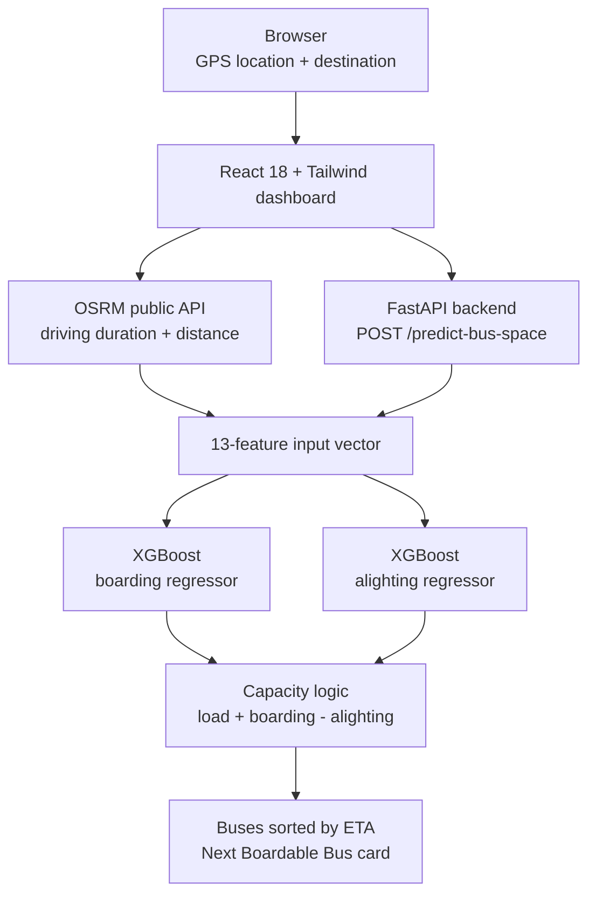

<div align="center">

# 🚌 CommuteSense

### Know which bus has space, not just when it arrives.

Predicts how full each incoming bus will be when it reaches your stop, then tells you the next one you can actually board.


</div>

---

## The problem

Transit apps such as Google Maps, Transit and Citymapper show when a bus will arrive. They do not show how full it is. You wait ten minutes, the bus pulls in packed, and you cannot get on.

CommuteSense predicts the passenger turnover at each stop before the bus gets there: how many people will get on and how many will get off. From that it works out how much space is left and which arriving bus you can board.

## How it works

1. **You give it two points.** The browser reads your GPS location and you pick a destination.
2. **It gets the road data.** The OSRM API returns driving duration and distance between the stop and the destination.
3. **It gets the incoming buses.** Each bus comes with its line, position on the route, current passenger count, seat count and ETA.
4. **Two models predict the turnover.** One predicts how many passengers board at the stop, the other how many get off. Inputs include day of week, time, location, route and the OSRM values.
5. **It scores each bus.**

```text
projected_occupancy = current_load + predicted_boarding - predicted_alighting
free_space          = vehicle_seats - projected_occupancy
is_boardable        = free_space > 0
```

6. **It sorts by arrival time.** The first bus with `is_boardable = true` becomes the **Next Boardable Bus** card.

## Architecture



## Features

| Feature | What it does |
|---|---|
| **Two XGBoost models** | Separate regressors for boardings and alightings, each returning a prediction in under 15 ms |
| **Space scoring** | Computes free seats at arrival and flags each bus as boardable or not |
| **Route-aware inputs** | Uses OSRM distance and travel time so the model knows how far riders are likely to travel |
| **Live dashboard** | GPS tracking through `navigator.geolocation`, a Next Boardable Bus card and a capacity table for all incoming buses |

## Model

| | |
|---|---|
| **Algorithm** | Two `xgboost.XGBRegressor` models |
| **Tree method** | `hist` |
| **Hyperparameters** | `n_estimators=300`, `learning_rate=0.05`, `max_depth=6`, `subsample=0.8`, `colsample_bytree=0.8` |
| **Evaluation** | 20% held-out test split |

| Target | MAE (passengers) |
|---|---|
| Boarding | **5.76** |
| Alighting | **5.37** |

<details>
<summary><b>The 13 input features</b></summary>

| # | Feature | Group |
|---|---|---|
| 1 | `line_id` | Route |
| 2 | `stop_id` | Route |
| 3 | `stop_position` | Route |
| 4 | `day_of_week` | Time |
| 5 | `hour` | Time |
| 6 | `minute` | Time |
| 7 | `stop_lat` | Location |
| 8 | `stop_lon` | Location |
| 9 | `dest_lat` | Location |
| 10 | `dest_lon` | Location |
| 11 | `osrm_traversal_duration_sec` | Road data |
| 12 | `osrm_distance_m` | Road data |
| 13 | `vehicle_seats` | Vehicle |

</details>

## Quick start

**Requirements:** Python 3.10+, Node.js 18+ and npm.

### 1. Backend

```bash
git clone https://github.com/<your-username>/CommuteSense.git
cd CommuteSense

python -m venv venv
source venv/bin/activate        # Windows: venv\Scripts\activate

pip install -r requirements.txt
uvicorn main:app --host 0.0.0.0 --port 8000 --reload
```

The API runs at `http://localhost:8000`. Interactive docs are at `http://localhost:8000/docs`.

### 2. Frontend

```bash
cd commute-sense-frontend
npm install
npm run dev
```

Open `http://localhost:5173`.

## API

### `POST /predict-bus-space`

Takes your stop, your destination and a list of incoming buses. Returns a boardability prediction for each bus.

<details open>
<summary><b>Request</b></summary>

```json
{
  "stop_lat": 17.3850,
  "stop_lon": 78.4867,
  "dest_lat": 17.4401,
  "dest_lon": 78.3489,
  "buses": [
    {
      "bus_id": "BUS-Line-73A",
      "line_id": 73,
      "stop_id": 104,
      "stop_position": 12,
      "current_load": 54,
      "vehicle_seats": 60,
      "eta_seconds": 180
    }
  ]
}
```

</details>

<details open>
<summary><b>Response</b></summary>

```json
{
  "status": "success",
  "predictions": [
    {
      "bus_id": "BUS-Line-73A",
      "eta_min": 3.0,
      "pred_boarding": 2.8,
      "pred_alighting": 10.5,
      "projected_occupancy": 46.3,
      "free_space": 13.7,
      "is_boardable": true,
      "status": "RECOMMENDED (BEST)"
    }
  ]
}
```

Worked example: `54 + 2.8 - 10.5 = 46.3` passengers on arrival, so `60 - 46.3 = 13.7` free seats.

</details>

## Project structure

```text
CommuteSense/
├── commute-sense-frontend/    # React 18 + Tailwind CSS client
│   ├── src/
│   ├── package.json
│   └── vite.config.js
├── main.py                    # FastAPI service and scoring pipeline
├── model_boarding.json        # Trained XGBoost weights: boardings
├── model_alighting.json       # Trained XGBoost weights: alightings
├── requirements.txt
└── README.md
```

## Known limitations

- An average error of about 5 to 6 passengers is large next to a 60-seat bus. Buses that finish close to full are the least reliable calls.
- The public OSRM server is meant for demos and rate-limits heavy use. A self-hosted OSRM instance is needed for real deployment.
- Bus telemetry (current load, ETA) is passed in the request body. A live feed is not connected yet, see the roadmap.

## Roadmap

- [x] Offline training of both XGBoost models with stop-to-stop delta features
- [x] FastAPI inference backend with request validation
- [x] React dashboard with OSRM data
- [ ] Live bus feed through GTFS-Realtime (vehicle positions and trip updates)
- [ ] Benchmark against Temporal Fusion Transformers and BiLSTMs
- [ ] Weather inputs (rain and temperature)
- [ ] Docker image and deployment on Google Cloud Run
